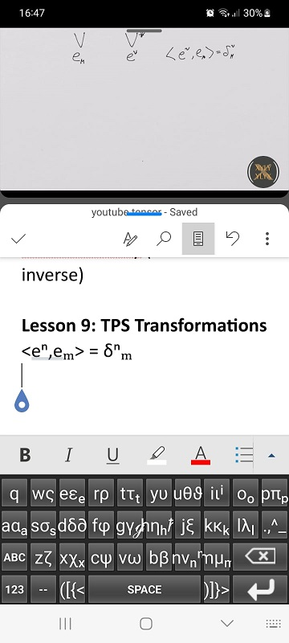

# android-math-notes
An android keyboard for taking math notes while watching split screen videos.

I made this because there was not enough space on the screen for a youtube video, 
an editor and a keyboard. I also decided to add some potentially useful unicode
characters that are often easier to type than accessing the menus in the editing 
app.

It looks something like this:

